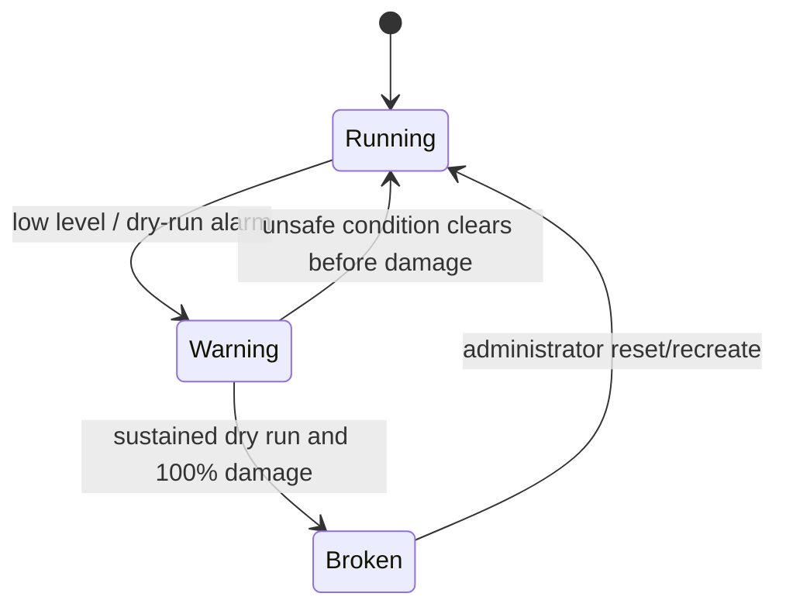

# Architecture

## System overview


The reviewable Mermaid source is stored at
[`assets/architecture.mmd`](assets/architecture.mmd). The checked-in PNG keeps
the diagram readable in Markdown previewers that do not support Mermaid.

The control network carries player-visible industrial traffic. The field
network is simulation plumbing and is not reachable from the player container.
Both are Docker `internal` networks without a default route to the Internet.

## Components

### Physical process (`plant`)

The authoritative state owner advances at a 100 ms period. It models:

- TK-101 tank level and inlet flow;
- P-101 pump flow, temperature, vibration, dry-run duration and damage;
- bottle fill percentage and conveyor position;
- good/rejected production counts;
- low-level, dry-run and spill alarms;
- terminal machine state.

Actuator commands are accepted only from an authenticated field-network API.
The API token is present in the plant, PLC and checker containers, but not in
FUXA or the player workstation.

### PLC-101 (`plc1`)

PLC-101 exposes Modbus/TCP port 502 on `172.30.10.11`. It runs a 200 ms control
scan for the tank inlet and transfer pump.

Automatic and manual pump modes both enforce the reported low-level permissive.
PLC-101 obtains that value from RIO-101 over unauthenticated Modbus/TCP. It has
no independent hardwired low-level trip, so false high telemetry defeats the
assumption behind otherwise correct controller logic.

### Remote I/O (`rio`)

RIO-101 exposes Modbus/TCP at `172.30.10.13:502`. It reads the authoritative
physical tank level through the private simulation network, applies a signed
maintenance calibration bias from holding register 40001, and reports the
result to PLC-101. A control-network host can change the bias because classic
Modbus/TCP does not authenticate the writer or protect message integrity.

### PLC-102 (`plc2`)

PLC-102 exposes Modbus/TCP port 502 on `172.30.10.12`. It indexes the conveyor
after a bottle reaches its fill target. It is operational context rather than
the primary vulnerable controller.

### SCADA/HMI (`scada`)

The operator HMI is FUXA 1.3.1, pinned by image digest. It polls PLC-101 and
PLC-102 directly over Modbus/TCP and therefore displays the same corrupted
LT-101 value trusted by the controller. It does not connect to RIO-101 and does
not receive the plant API token.

FUXA also polls the checker through a read-only WebAPI device. Before terminal
damage the proof tag is null. After the checker validates the physical failure,
the `flag{...}` value appears in the red incident banner. The editor is guarded
by authentication; its administrator password and JWT secret are replaced by
fresh random values on every container creation. Players receive guest view
access only, and guest socket writes are rejected by FUXA.

The process mimic uses native FUXA actions tied to the same PLC tags. The P-101
impeller rotates only while PLC-101 reports the pump running. The CV-101 belt
and drive animate only while PLC-102 reports the conveyor running. A progress
gauge inside the active bottle follows PLC-102's measured bottle level. This
keeps the visual state causally aligned with the simulated process.

### Player workstation (`player`)

The only direct entry into `control_net`. It runs an unprivileged `player`
account with `nmap`, `curl`, `netcat`, `tcpdump`, and the `mbcli` Modbus helper.
Modbus function 43/14 supplies device identity. The workstation has no hidden
register map, Docker socket, host mounts, plant token or flag secret.

### Incident validator (`checker`)

The validator reads only authoritative plant state. It returns the flag when:

```text
machine_state == BROKEN
and pump_damage >= 100%
and latched_dry_run_seconds >= 9
```

The flag is derived as `HMAC-SHA256(FLAG_SECRET, INSTANCE_ID + condition)` and
is not stored in any player-reachable image or file.

## Network inventory

| Network | Address | Component | Externally published |
|---|---:|---|---|
| control | `172.30.10.11:502` | PLC-101 | No |
| control | `172.30.10.12:502` | PLC-102 | No |
| control | `172.30.10.13:502` | RIO-101 level gateway | No |
| control | `172.30.10.20:1881` | FUXA HMI | Through edge port 8089 |
| control | `172.30.10.50` | Player workstation | Through edge port 2224 |
| field | `172.30.20.10:8000` | Physical process | No |
| field | `172.30.20.40:8080` | Checker | Through edge port 8090 |

## State sequence



## Intended causal chain


Source: [`assets/attack-chain.mmd`](assets/attack-chain.mmd).
